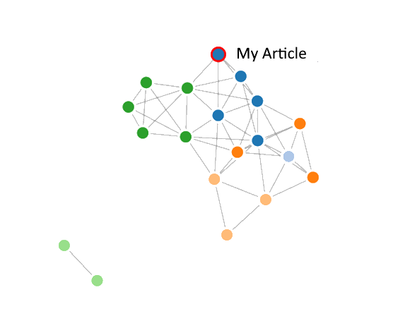

# Knowledge
📚 Represent personal Knowledge as a graph, with nodes for tags and edges for connections between them. The connections are computed based on the number of articles in commun for one tag. This should serve as a way to discover visually new content, and browse through existing content.

## Processing Workflow

## Tag generation

### Manually

Services like [Diigo](https://www.diigo.com/) can be used to save and tag online resources manually.

### Automatically

Tags can be automatically generated via supervised classification methods:

1. *Training*

2. *Inference*

## Graph drawing

Based on the list of articles and tags, two types of graphs can be drawn; a graph of articles, or a graph of tags - representing the corpus (workflow detailed here):

1. First representing an article as a vector

 [Knowledge Graph - Wikipedia, the free encyclopedia](http://en.wikipedia.org/wiki/Knowledge_Graph)

Tags: __google__ __wikipedia__ __science__ 

2. Second building the [adjacency matrix](https://en.wikipedia.org/wiki/Adjacency_matrix):
Depending on how the matrix is computed, the nodes are either the articles or the tags.
In this example, the nodes are the tags:

    **Z55 = T59*T95**

3. Third drawing the graph from the adjacency matrix

## Previous implementations

- Article graph

- Tag graph

## References:

- Fundamentals of Predictive Text mining